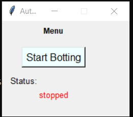

# MaplestoryFaaS
Farming as a Service kekw

# Description

- Python bytecode for concealment
- UI for simplified auto farming
- Auto buff (stance, decent hs, etc) & pet feed for extended farming hours

# Requirements

- Character with stance 100% (minimum: Mihile link lvl 2 + ~64% buff duration)

# Instructions

- Import a farming routine and expose the routine as an inherited function

# Benchmarks

- "Farmed" for over 12 hour continuous sessions without crashing/dc
- Made over 13b meso, 500 nodes, and 40 droplets before the 5/10/15 event while playing Valorant on main pc lol

# Roadmap

- Include some CV for rune pathing
- Friend/random player detection & program halting
- Eboss detection & cc